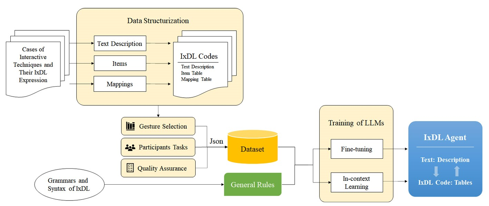

# IxDL Agent
IxDL Agent: Designing Interaction with LLM

## Introduction
This study investigates the application of LLMs in generating designs for interactive techniques using Interaction Design Language (IxDL). Amidst rapid advancements in AIGC, the potential of LLMs remains underexplored in interaction design, primarily due to challenges in formally describing interaction and the evolving complexity of interaction forms such as AR/VR. This study highlights LLMs’ adaptability and proficiency in enhancing interaction design processes by establishing a structured data format and training an LLM to generate IxDL Code from text and vice versa. The outcomes of our study hold promise not only for enhancing the creativity and efficiency of interaction designers but also for broadening the spectrum of AIGC’s content, marking a potential leap forward in both fields. Future applications of this study include AI assistants in interaction design practice, evaluation, and education.

## Supplementary Materials

- general rules.py: The general rules fed to the system role in OPENAI's chat.completions API.
- dataset.json: The 24 cases in the training dataset, each case contains case_description, item table, and mapping table that fully defines a specific interaction technique.
